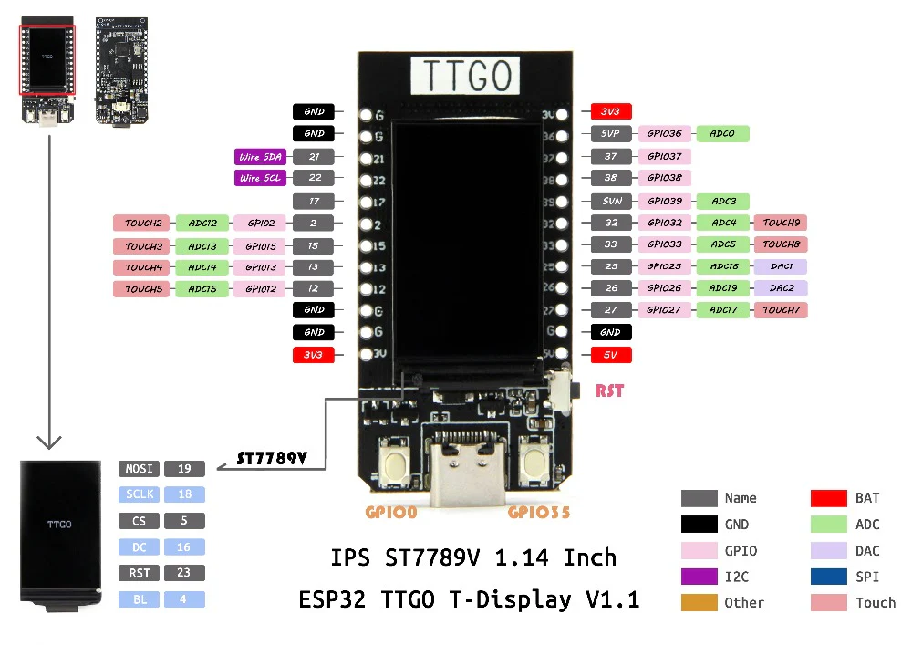

# TinyBeanBoi

Tiny Games Challenge Entry
https://hackaday.io/contest/196871-tiny-games-challenge

Game Design Document 
https://docs.google.com/document/d/1beK_Rb5zcQEk4hUwibhF79FwWzQywaa5AEWXBtblu60/edit?usp=sharing


### Tiny qualifications: 
- Tiny pocket-size device (Esp32)

#### Honerable Mentions: 
- "The Classics" We are recreating a Tamagachi with our own twist for modern hardware.
- "Pocket Arcade" Just like a Tamagachi, it should be able to hook to a belt loop, and be carried around.

## Team
- Vi Prime      @vprime
  - Programming
- Isaac Pahona  @CheftoTheLeft
  - Art
- Tyler Shauger @git-stop-please
- Will Kostecki @WillKostecki
- Eli Young
  - Art


# Development
## Setup

This project is split into 3 main source components
- game: provides the bulk of the gameplay source, most of the code will go into here.
- pocket: provides the binary for programming to the ESP32 pocket device
- desktop: provides a desktop version of the game for Windows and Linux

The other folders
- assets: Contains files that will be included within the output binary
- docs: Contains Documention outside of common root assets.
- artsrc: Contains source materials for game art assets.

### Building to Desktop
The Desktop App will provide a simple simulation of the pocket device.
Requirements:
- Rust & Cargo: https://www.rust-lang.org/tools/install

Follow the above guide to install rust.
After that, enter the desktop directory and run the command 

```cargo run```

And the game will play


### Building to the Pocket device
This unique piece of hardware requires some extra components outside of the standard rust toolchain.
Requirements:
- Rust & Cargo
- LILYGO T-Display V1.1
- USB-C cable
- espup
- ESP-IDF
- ldproxy

To set up espup, ESP-IDF, and ldproxy please follow along with the following pages in the "Rust on ESP Book":
When asked, select at least "ESP32", and "Xtensa". You could also install for more devices, if you don't mind the disk usage.
- https://docs.esp-rs.org/book/installation/riscv-and-xtensa.html
- https://docs.esp-rs.org/book/installation/std-requirements.html
- Alternatively you can install in Docker: https://docs.esp-rs.org/book/installation/using-containers.html

Once these steps are completed, enter the "pocket" directory and use the command

```cargo run```

to build and install the game to your pocket device. 


## Sources

### Project
Graphics Library:
https://github.com/embedded-graphics/embedded-graphics

Bitmap Parser:
https://crates.io/crates/tinybmp


### Pocket Device Specific
Display Software
https://github.com/almindor/mipidsi (Newest, most mature, more generic)

LILYGO T-Display Github: (Contains 3D files, Schematics, and Display Drivers in C)
https://github.com/Xinyuan-LilyGO/TTGO-T-Display/tree/master

### Desktop Specific
UI Library:
https://github.com/emilk/egui

### Manuals

espup (Building for ESP32):
https://docs.esp-rs.org/book/installation/riscv-and-xtensa.html

Embedded rust book:
https://docs.rust-embedded.org/book/interoperability/index.html

Embedded Rust on Espressif:
https://docs.esp-rs.org/std-training/01_intro.html

## Target Pocket Device
Cheap ESP32 devices with displays and at least 2 buttons.
- https://www.lilygo.cc/products/lilygo%C2%AE-ttgo-t-display-1-14-inch-lcd-esp32-control-board
- https://www.amazon.com/HiLetgo-Display-Bluetooth-Internet-Development/dp/B07X1W16QS/

Batteries
- https://www.amazon.com/MakerFocus-Rechargable-Protection-Insulated-Development/dp/B07CXNQ3ZR/

Speakers
- DC5V Mini Piezo Speaker https://www.amazon.com/dp/B07VK1GJ9X

CPU Datasheet
- https://www.espressif.com/sites/default/files/documentation/esp32_datasheet_en.pdf

### Pins

Buttons:
- Left: GPIO0 
- Right: GPIO35

Audio:
- Pin 25: GPIO25 DAC1
- Pin 26: GPIO25 DAC2

Video SPI:
- MOSI: GPIO19
- SCLK: GPIO18
- CS: GPIO5
- DC: GPIO16
- RST: GPIO23
- Backlight: GPIO4

### Hardware Specifications:
- Chipset: ESPRESSIF-ESP32 240MHz Xtensa single-/dual-core 32-bit LX6 microprocessor
- FLASH: QSPI flash 4MB
- SRAM: 520 kB SRAM
- Button: Reset
- USB to TTL: CH9102
- Modular interface: UART, SPI, SDIO, I2C, LED PWM, TV PWM, I2S, IRGPIO, ADC, capacitor touch sensor, DACLNA pre-amplifier
- Display: IPS ST7789V 1.14 Inch 135 x 240 (260ppi) 
- Working voltage: 2.7V-4.2V
- Working current: About 60MA
- Sleep current: About 120uA
- Working temperature range: -40°C ~ +85°C
- Size Weight: Approx. 51.52*25.04*8.54mm (7.81g)
- Power Supply Specifications:
- Power Supply: USB 5V/1A
- Charging current: 500mA
- Battery: 3.7V lithium battery
- JST Connector: 2Pin 1.25mm
- USB: Type-C
### Wi-Fi:
- Standard: FCC/CE-RED/IC/TELEC/KCC/SRRC/NCC
- Protocol 802.11 b/g/n (802.11n, speed up to 150Mbps) A-MPDU and A-MSDU polymerization, support 0.4μS Protection interval
- Frequency range: 2.4GHz~2.5GHz (2400M~2483.5M)
- Transmit Power: 22dBm
- Communication distance: 300m
### Bluetooth:
- Protocol Meet Bluetooth v4.2BR/EDR and BLE standard
- Radio frequency With -97dBm sensitivity NZIF receiver Class-1,Class-2&Class-3 emitter AFH
- Audio frequency CVSD&SBC audio frequency
### Software specification:
- Wi-Fi Mode: Station/SoftAP/SoftAP+Station/P2P
- Security mechanism: WPA/WPA2/WPA2-Enterprise/WPS
- Encryption Type: AES/RSA/ECC/SHA
- Firmware upgrade UART download/OTA(Through network/host to download and write firmware)
- Software Development: Support cloud server development /SDK for user firmware development
- Networking protocol: IPv4, IPv6, SSL, TCP/UDP/HTTP/FTP/MQTT
- User Configuration: AT + Instruction set, cloud server, android/iOSapp
- OS: FreeRTOS